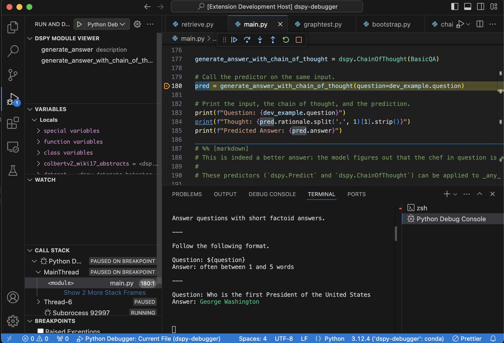
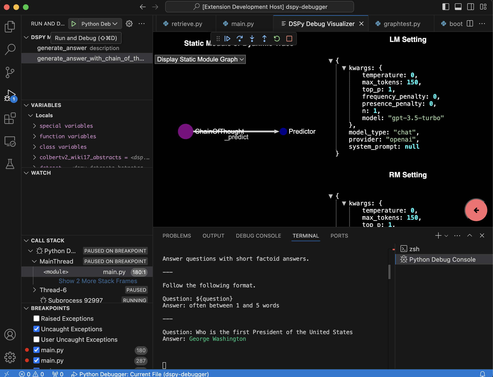
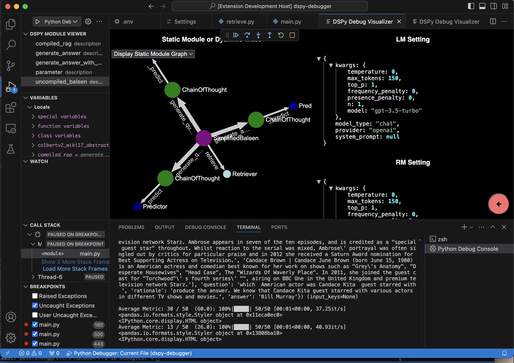
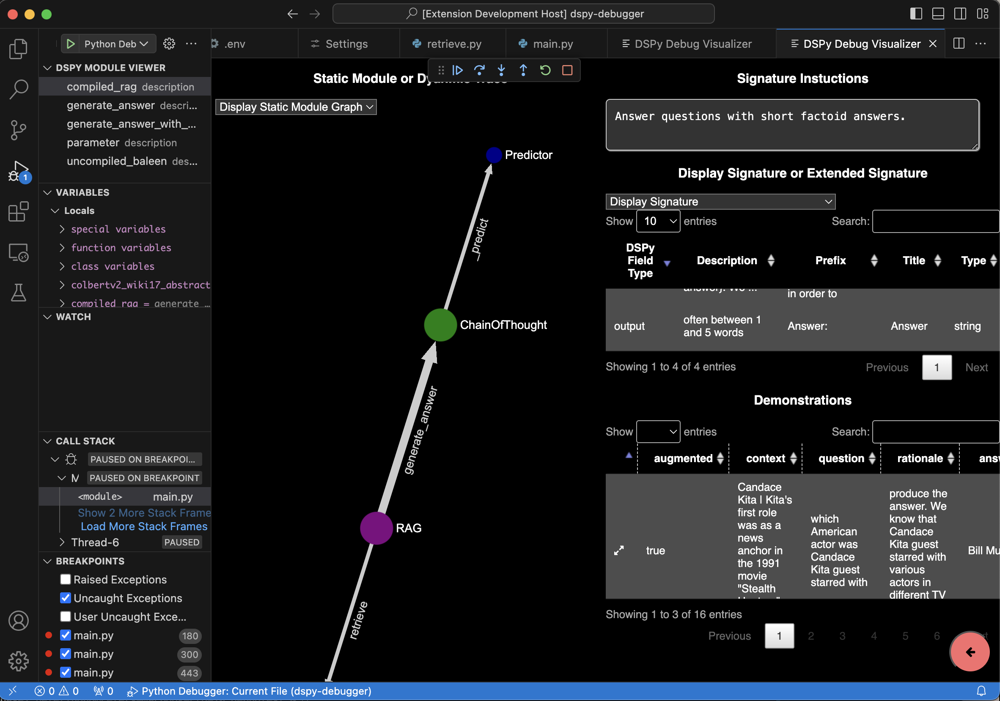
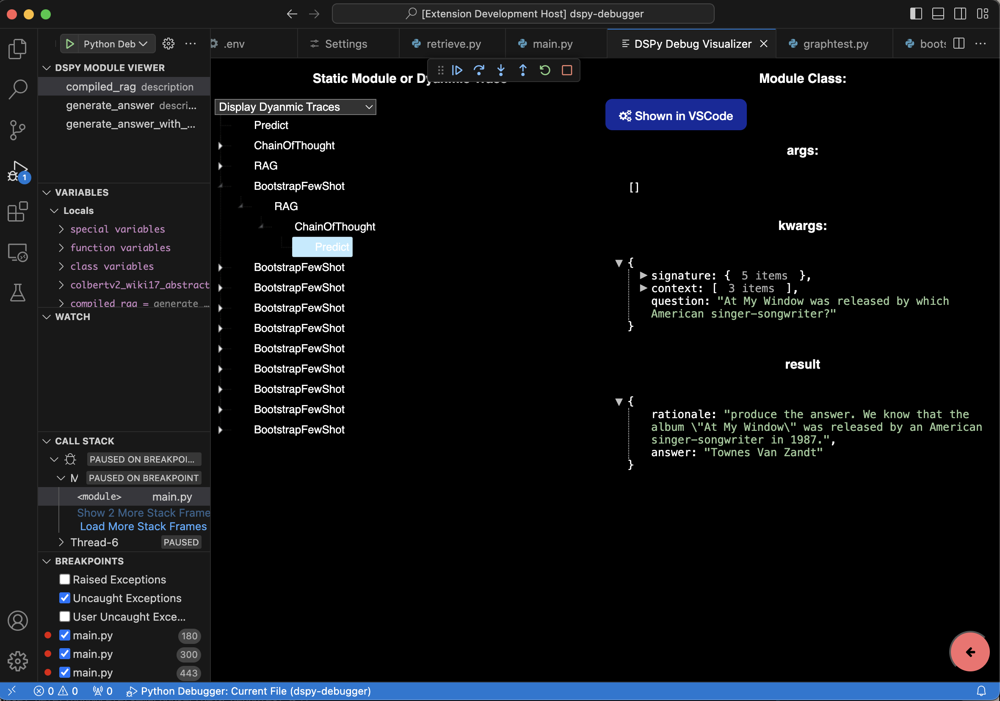

# DSPy Debugger VSCode Plugin

WARNING: RESEARCH IN PROGRESS (meaning it's hella unstable and probably won't work/compile)

This is the repo for a DSPy Debugger that can be integrated with VSCode to give developers a *live* debugging experience with LLM models when programming in the DSPy framework. This work aims to extend the myraid of tracing and observability tools that offer posteriori analysis of the DSPy execution traces, and aim to provide more inspection and interactability opportunities. This tool aims to serve the role of a traditional debugger, but provides features helpful for the needs of DSPy and LM programming. 

# How to Run?

Whilst the goal is to transparently interact with DSPy without modification to its core code, the first iteration of this tool requires some minor changes to its codebase. Please refer to this feature branch (https://github.com/peteryongzhong/dspy) and make sure there exist an virtual environment in your machine in which the DSPy library installed points to the feature branch.  

Open the project in VSCode and ensure that the VSCode Extension Tester (https://marketplace.visualstudio.com/items?itemName=ms-vscode.extension-test-runner) is installed. Run `node esbuild.js` to compile the relevant code, and run the project to launch a VSCode instance with the debugger extension installed. 

# Current Features 

## DSPy Variable 

During a debugging sesson, developers could see a list variables in scope that could be inspected using the DSPy Debugger. 

## DSPy Module Visualization

By pressing on the variables, developers are shown additional information like the structure of the module:

For more complex modules, this could be helpful:

## DSPy Metadata Inspection

You could press on a node in the graph to inspect the metadata(like signature, prompt and demos) for a module, and even to open it directly in VSCode to inspect its source code.

## DSPy Dynamic Trace Inspection 

To see how your program has been running, and to understand how the optimizers work, the DSPy debugger provides a way of visualizing the traces in a tree setting and the metadata with the trace can be displayed. 

